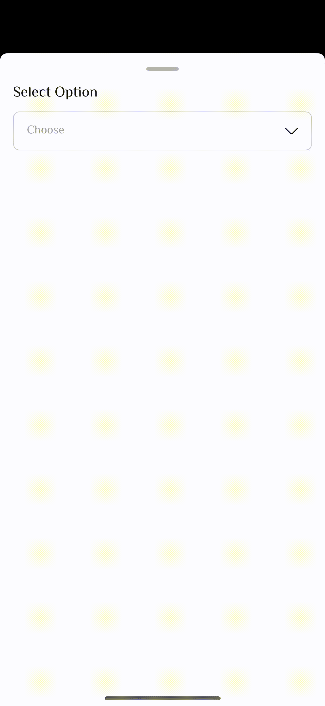

# React Native Bottom Sheet Dropdown

A customizable dropdown component with bottom sheet UI for React Native applications. This component provides a smooth, native-feeling dropdown experience with modal presentation.

## Demo

### English Version
<div align="center">
  
</div>


### Arabic Version (RTL Support)
<div align="center">
  
</div>

## Features

- ✅ **Bottom Sheet Modal**: Elegant modal presentation from bottom of screen
- ✅ **Customizable Styling**: Full control over appearance and styling
- ✅ **RTL Support**: Right-to-left language support
- ✅ **TypeScript Support**: Full TypeScript definitions included
- ✅ **Responsive Design**: Uses responsive screen dimensions
- ✅ **Smooth Animations**: Built-in animations for modal presentation
- ✅ **Selected State**: Visual feedback for selected items
- ✅ **Accessibility**: Proper accessibility support

## Installation

```bash
npm install react-native-bottom-sheet-dropdown
```

### Dependencies

This package requires the following peer dependencies:

```bash
npm install react-native-modal react-native-responsive-screen react-native-svg
```

For iOS, you'll also need to run:

```bash
cd ios && pod install
```

## Basic Usage

```tsx
import React, { useState } from 'react';
import { View } from 'react-native';
import { BottomSheetDropdown, DropdownItem } from 'react-native-bottom-sheet-dropdown';

const data: DropdownItem[] = [
  { label: 'Option 1', value: '1' },
  { label: 'Option 2', value: '2' },
  { label: 'Option 3', value: '3' },
];

const App = () => {
  const [selectedOption, setSelectedOption] = useState<DropdownItem | undefined>();

  return (
    <View style={{ padding: 20 }}>
      <BottomSheetDropdown
        data={data}
        onSelect={(item) => setSelectedOption(item)}
        selectedOption={selectedOption}
        placeholder="Choose an option"
        title="Select Item"
        dropdownModalProps={{
          dropdownProps: {
            dropdownTitle: 'Select Option',
            closeTitle: 'Close'
          }
        }}
      />
    </View>
  );
};

export default App;
```

## Props

### BottomSheetDropdown Props

| Prop | Type | Default | Description |
|------|------|---------|-------------|
| `data` | `DropdownItem[]` | **Required** | Array of dropdown items |
| `onSelect` | `(item: DropdownItem) => void` | **Required** | Callback when item is selected |
| `selectedOption` | `DropdownItem` | `undefined` | Currently selected item |
| `placeholder` | `string` | `"Select an option"` | Placeholder text |
| `title` | `string` | `""` | Title displayed above dropdown |
| `rtl` | `boolean` | `false` | Right-to-left layout support |
| `selectedValue` | `string \| number` | `undefined` | Alternative way to set selected value |
| `style` | `ViewStyle` | `undefined` | Container style |
| `dropdownStyle` | `ViewStyle` | `undefined` | Dropdown button style |
| `mainDropdownInput` | `ViewStyle` | `undefined` | Main dropdown input style |
| `titleStyle` | `TextStyle` | `undefined` | Title text style |
| `selectedValueStyle` | `TextStyle` | `undefined` | Selected value text style |
| `placeholderStyle` | `TextStyle` | `undefined` | Placeholder text style |
| `dropdownModalProps` | `DropdownModalProps` | **Required** | Modal configuration |

### DropdownItem

```tsx
interface DropdownItem {
  label: string;
  value: string;
}
```

### DropdownModalProps

```tsx
interface DropdownModalProps {
  dropdownProps?: {
    dropdownTitle: string;
    closeTitle: string;
  };
  dropdownStyles?: {
    dropdownTitleStyle?: TextStyle;
    closeTitleStyle?: TextStyle;
    optionValueText?: TextStyle;
    selectedOptionText?: TextStyle;
    optionContainerStyle?: ViewStyle;
  };
}
```

## Advanced Usage

### Custom Styling

```tsx
<BottomSheetDropdown
  data={data}
  onSelect={handleSelect}
  selectedOption={selectedOption}
  placeholder="Custom placeholder"
  title="Custom Title"
  titleStyle={{
    fontSize: 18,
    fontWeight: 'bold',
    color: '#333'
  }}
  mainDropdownInput={{
    backgroundColor: '#f5f5f5',
    borderRadius: 12,
    borderWidth: 2,
    borderColor: '#ddd'
  }}
  selectedValueStyle={{
    color: '#007AFF',
    fontWeight: '600'
  }}
  placeholderStyle={{
    color: '#999',
    fontStyle: 'italic'
  }}
  dropdownModalProps={{
    dropdownProps: {
      dropdownTitle: 'Choose Option',
      closeTitle: 'Cancel'
    },
    dropdownStyles: {
      dropdownTitleStyle: {
        fontSize: 18,
        fontWeight: 'bold'
      },
      closeTitleStyle: {
        color: '#007AFF',
        fontSize: 16
      },
      optionValueText: {
        fontSize: 16,
        color: '#333'
      },
      selectedOptionText: {
        color: '#007AFF',
        fontWeight: '600'
      },
      optionContainerStyle: {
        paddingVertical: 12
      }
    }
  }}
/>
```

### RTL Support

```tsx
<BottomSheetDropdown
  data={data}
  onSelect={handleSelect}
  selectedOption={selectedOption}
  rtl={true}
  placeholder="اختر خيار"
  title="العنوان"
  dropdownModalProps={{
    dropdownProps: {
      dropdownTitle: 'اختر خيار',
      closeTitle: 'إغلاق'
    }
  }}
/>
```

### Using with Form Libraries

```tsx
import { useFormContext, Controller } from 'react-hook-form';

const FormDropdown = () => {
  const { control } = useFormContext();

  return (
    <Controller
      control={control}
      name="selectedOption"
      render={({ field: { onChange, value } }) => (
        <BottomSheetDropdown
          data={data}
          onSelect={onChange}
          selectedOption={value}
          placeholder="Select option"
          dropdownModalProps={{
            dropdownProps: {
              dropdownTitle: 'Select Option',
              closeTitle: 'Close'
            }
          }}
        />
      )}
    />
  );
};
```

## Exports

The package exports the following components and utilities:

```tsx
import {
  BottomSheetDropdown,        // Main component
  DownIcon,                   // Dropdown arrow icon
  TickIcon,                   // Selected item icon
  hp,                         // Height percentage utility
  wp,                         // Width percentage utility
  DropdownDefaults,           // Default values
  
  // TypeScript types
  DropdownItem,
  DropdownProps,
  DropdownModalProps,
  DropdownDataProps,
  DropdownModalStyles
} from 'react-native-bottom-sheet-dropdown';
```

## Default Values

```tsx
const DropdownDefaults = {
  placeholder: 'Select an option',
  title: '',
  rtl: false,
  dropdownProps: {
    dropdownTitle: 'Select Option',
    closeTitle: 'Close'
  }
};
```

## Responsive Design

The component uses responsive dimensions based on screen size:
- `hp(percentage)` - Height percentage of screen
- `wp(percentage)` - Width percentage of screen

These utilities are also exported for use in your custom styling.

## Contributing

1. Fork the repository
2. Create your feature branch (`git checkout -b feature/amazing-feature`)
3. Commit your changes (`git commit -m 'Add some amazing feature'`)
4. Push to the branch (`git push origin feature/amazing-feature`)
5. Open a Pull Request

## Requirements

- React Native >= 0.60.0
- React >= 16.8.0
- TypeScript >= 4.9.0 (for TypeScript projects)

## License

MIT License - see the [LICENSE](LICENSE) file for details.

## Troubleshooting

### Common Issues

1. **Modal not appearing**: Ensure you have `react-native-modal` installed and linked properly
2. **Icons not showing**: Make sure `react-native-svg` is properly installed and configured
3. **TypeScript errors**: Ensure you have the latest version with proper type definitions

### Platform-specific Setup

**iOS**: Run `cd ios && pod install` after installation

**Android**: The package should work out of the box with autolinking

## Changelog

### v1.0.0
- Initial release
- Bottom sheet modal dropdown
- TypeScript support
- RTL support
- Customizable styling
- Responsive design

---

**Made with ❤️ for React Native developers**